# System Architecture Documentation

## Table of Contents

1. [System Architecture Overview](#system-architecture-overview)
2. [Service Descriptions](#service-descriptions)
3. [Database Schemas](#database-schemas)
4. [Communication Patterns](#communication-patterns)
5. [Hexagonal Architecture Details](#hexagonal-architecture-details)
6. [Shared Package](#shared-package)
7. [Infrastructure Components](#infrastructure-components)

## System Architecture Overview

The vbar-viber-bot project follows a **microservices architecture** pattern, consisting of four independent services that communicate through REST APIs and message queues. Each service is designed using the **Hexagonal Architecture (Ports and Adapters)** pattern to ensure separation of concerns, testability, and independence from external frameworks.

### Architecture Principles

- **Service Independence**: Each service has its own database and can be developed, deployed, and scaled independently
- **Hexagonal Architecture**: All services follow the Ports and Adapters pattern for clean separation of business logic from infrastructure
- **Event-Driven Communication**: Asynchronous communication via RabbitMQ message queue for decoupled service interactions
- **Synchronous Communication**: REST APIs for direct service-to-service communication when needed
- **Database per Service**: Each service maintains its own MongoDB database instance

### High-Level Architecture

```
                    ┌─────────────────┐
                    │   Admin Service │
                    │    (Next.js)    │
                    └────────┬────────┘
                             │
                ┌────────────┼────────────┐
                │            │            │
            REST│        REST│        REST│
                │            │            │
        ┌───────▼───┐  ┌─────▼────┐  ┌───▼────────┐
        │   Viber   │  │    AI    │  │  Analytics │
        │  Service  │  │ Service  │  │  Service   │
        │ (Express) │  │(Express) │  │ (Express)  │
        └─────┬─────┘  └─────┬────┘  └─────┬──────┘
              │              │             │
              │              │             │
         gRPC │              │             │
              │              │             │
              └──────┬───────┘             │
                     │                     │
             RabbitMQ│(async)              │
                     │                     │
              ┌──────▼──────┐              │
              │  RabbitMQ   │              │
              │(analytics.  │              │
              │  events)    │              │
              └─────────────┘              │
                                           │
        ┌──────────┐  ┌──────────┐  ┌──────▼─────┐  ┌──────────┐
        │ MongoDB  │  │ MongoDB  │  │  MongoDB   │  │ MongoDB  │
        │  (bot)   │  │   (ai)   │  │(analytics) │  │ (admin)  │
        └──────────┘  └──────────┘  └────────────┘  └──────────┘

Communication Protocols:
━━━━━━ REST API (Admin ↔ Viber, Admin ↔ AI, Admin ↔ Analytics)
══════ gRPC (Viber ↔ AI)
────── RabbitMQ (Viber → Analytics, asynchronous)
```

## Service Descriptions

### Admin Service

**Technology Stack**: Next.js 14+ (App Router), TypeScript, MongoDB

**Purpose and Responsibilities**:

- Administrative dashboard and user interface
- User management and authentication
- System configuration and settings
- Service monitoring and health checks
- Content management for bot responses

**Database**: `admin` MongoDB database

**Database Schema Overview**:

- **Users**: User accounts, roles, and permissions
- **Configurations**: System-wide settings and bot configurations
- **Sessions**: User authentication sessions
- **Audit Logs**: Administrative actions and system events

**Hexagonal Architecture Adaptation**:

- Next.js App Router serves as the input adapter (HTTP layer)
- Domain and Application layers contain business logic
- MongoDB repository adapters implement output ports
- API routes act as input adapters for REST endpoints

### Viber Service

**Technology Stack**: Node.js, Express.js, TypeScript, MongoDB

**Purpose and Responsibilities**:

- Viber bot webhook handling
- Message processing and routing
- User interaction management
- Bot state management
- Integration with Viber API

**Database**: `bot` MongoDB database

**Database Schema Overview**:

- **Conversations**: User conversation threads and history
- **Messages**: Incoming and outgoing messages
- **Users**: Viber user profiles and metadata
- **Bot State**: Current bot state and context for each user
- **Webhooks**: Webhook event logs and processing status

**Hexagonal Architecture Structure**:

- Express routes as input adapters
- Domain layer contains bot logic and business rules
- Application layer orchestrates use cases
- MongoDB repositories as output adapters
- Message queue publishers for async communication

### AI Service

**Technology Stack**: Node.js, Express.js, TypeScript, MongoDB

**Purpose and Responsibilities**:

- AI model integration and processing
- Natural language processing (NLP)
- Message analysis and intent detection
- Response generation
- AI model training and fine-tuning (if applicable)
- Multi-provider AI model support (External APIs and Self-hosted)

**Database**: `ai` MongoDB database

**Database Schema Overview**:

- **Models**: AI model configurations and metadata
- **Training Data**: Datasets for model training
- **Processing Logs**: AI processing history and results
- **Configurations**: AI service settings and parameters
- **Analytics**: AI performance metrics and statistics

**AI Model Providers**:

The AI Service supports a **hybrid approach** with multiple AI model providers:

1. **External AI API Services (SaaS)**:

   - OpenAI (GPT-4, GPT-3.5, etc.)
   - Anthropic (Claude)
   - Google (Gemini)
   - Other cloud-based AI services
   - Accessed via REST APIs

2. **Self-Hosted AI Models (Ollama)**:
   - Local LLM models (Llama 2, Mistral, etc.)
   - Deployed via Ollama service
   - Accessed via HTTP API
   - Provides data privacy and cost control

The AI Service can dynamically switch between providers based on configuration, allowing for:

- Fallback mechanisms (if one provider fails, use another)
- Cost optimization (use Ollama for simple tasks, external APIs for complex ones)
- Data privacy control (use Ollama for sensitive data)
- Load balancing across providers

**Hexagonal Architecture Structure**:

- Express routes as input adapters for API endpoints
- Domain layer contains AI business logic
- Application layer handles AI processing use cases
- MongoDB repositories for data persistence
- Multiple AI client adapters as output adapters:
  - External AI API clients (OpenAI, Anthropic, etc.)
  - Ollama client for self-hosted models
  - Provider selection and routing logic

### Analytics Service

**Technology Stack**: Node.js, Express.js, TypeScript, MongoDB

**Purpose and Responsibilities**:

- Data aggregation and analysis
- Reporting and dashboards
- User behavior analytics
- Performance metrics collection
- Business intelligence queries

**Database**: `analytics` MongoDB database

**Database Schema Overview**:

- **Events**: User events and interactions
- **Metrics**: Aggregated performance metrics
- **Reports**: Generated reports and analytics
- **Dashboards**: Dashboard configurations
- **Aggregations**: Pre-computed analytics data

**Hexagonal Architecture Structure**:

- Express routes as input adapters
- Domain layer contains analytics business logic
- Application layer handles analytics use cases
- MongoDB repositories for data storage
- Message queue consumers for event processing

## Database Schemas

### Admin Database Schema

```typescript
// User Collection
interface User {
  _id: ObjectId;
  email: string;
  passwordHash: string;
  role: "admin" | "operator" | "viewer";
  createdAt: Date;
  updatedAt: Date;
  lastLoginAt?: Date;
}

// Configuration Collection
interface Configuration {
  _id: ObjectId;
  key: string;
  value: any;
  description?: string;
  updatedBy: ObjectId; // User ID
  updatedAt: Date;
}

// Session Collection
interface Session {
  _id: ObjectId;
  userId: ObjectId;
  token: string;
  expiresAt: Date;
  createdAt: Date;
}

// Audit Log Collection
interface AuditLog {
  _id: ObjectId;
  userId: ObjectId;
  action: string;
  resource: string;
  details: Record<string, any>;
  timestamp: Date;
}
```

### Bot Database Schema

```typescript
// Conversation Collection
interface Conversation {
  _id: ObjectId;
  viberUserId: string;
  status: "active" | "paused" | "ended";
  context: Record<string, any>;
  createdAt: Date;
  updatedAt: Date;
  lastMessageAt: Date;
}

// Message Collection
interface Message {
  _id: ObjectId;
  conversationId: ObjectId;
  viberUserId: string;
  type: "incoming" | "outgoing";
  content: string;
  timestamp: Date;
  processed: boolean;
  metadata?: Record<string, any>;
}

// Viber User Collection
interface ViberUser {
  _id: ObjectId;
  viberUserId: string;
  name: string;
  avatar?: string;
  language?: string;
  country?: string;
  subscribed: boolean;
  subscribedAt?: Date;
  metadata?: Record<string, any>;
}

// Bot State Collection
interface BotState {
  _id: ObjectId;
  viberUserId: string;
  currentFlow: string;
  context: Record<string, any>;
  variables: Record<string, any>;
  updatedAt: Date;
}
```

### AI Database Schema

```typescript
// AI Model Collection
interface AIModel {
  _id: ObjectId;
  name: string;
  type: "nlp" | "generative" | "classification";
  version: string;
  configuration: Record<string, any>;
  status: "active" | "training" | "inactive";
  performance: {
    accuracy?: number;
    latency?: number;
    lastEvaluated?: Date;
  };
  createdAt: Date;
  updatedAt: Date;
}

// Processing Log Collection
interface ProcessingLog {
  _id: ObjectId;
  requestId: string;
  modelId: ObjectId;
  input: string;
  output: string;
  confidence?: number;
  processingTime: number;
  timestamp: Date;
  metadata?: Record<string, any>;
}

// Training Data Collection
interface TrainingData {
  _id: ObjectId;
  modelId: ObjectId;
  input: string;
  expectedOutput: string;
  tags: string[];
  createdAt: Date;
}
```

### Analytics Database Schema

```typescript
// Event Collection
interface Event {
  _id: ObjectId;
  type: string;
  userId: string;
  service: "admin" | "viber" | "ai" | "analytics";
  properties: Record<string, any>;
  timestamp: Date;
}

// Metric Collection
interface Metric {
  _id: ObjectId;
  name: string;
  value: number;
  unit: string;
  tags: Record<string, string>;
  timestamp: Date;
  aggregation?: {
    period: "hour" | "day" | "week" | "month";
    value: number;
  };
}

// Report Collection
interface Report {
  _id: ObjectId;
  name: string;
  type: "daily" | "weekly" | "monthly" | "custom";
  parameters: Record<string, any>;
  data: Record<string, any>;
  generatedAt: Date;
  generatedBy?: ObjectId; // User ID if manual
}
```

### Database Relationships

- **No Direct Foreign Keys**: Services maintain loose coupling through identifiers
- **Event-Based Synchronization**: Services communicate user/entity IDs through events
- **Shared Identifiers**: Common identifiers (e.g., `viberUserId`) used across services for correlation

## Communication Patterns

### REST API Communication (Synchronous)

Services communicate synchronously through REST APIs for most direct service-to-service interactions:

- **Admin Service → Viber Service**: Configuration updates, bot control commands
- **Admin Service → AI Service**: Model configuration, training triggers
- **Admin Service → Analytics Service**: Report generation, dashboard data, analytics queries

**Communication Flow**:

```
Client → Service A → REST API → Service B → Response → Service A → Client
```

### gRPC Communication (Synchronous, High-Performance)

The Viber Service and AI Service communicate using **gRPC** for high-performance, low-latency message processing:

- **Viber Service → AI Service**: Message processing requests, intent detection (via gRPC)

**Why gRPC for Viber ↔ AI**:

- Binary serialization (Protocol Buffers) is faster than JSON
- HTTP/2 multiplexing reduces connection overhead
- Lower latency for real-time message processing
- Type-safe contracts with Protocol Buffers
- Supports streaming for advanced use cases

**Communication Flow**:

```
Viber Service → gRPC Call → AI Service → gRPC Response → Viber Service
```

**gRPC Endpoint**: `localhost:50051` (development)

### Message Queue Communication (Asynchronous)

RabbitMQ is used **exclusively** for asynchronous communication from the Viber Service to the Analytics Service. This allows the Viber Service to send analytics events without blocking, and the Analytics Service to process them asynchronously.

**Queue Configuration**:

- **Queue Name**: `analytics.events`
- **Publisher**: Viber Service
- **Consumer**: Analytics Service

**Routing Keys**:

- `analytics.event` - General analytics event
- `analytics.message.received` - Message received event
- `analytics.message.sent` - Message sent event
- `analytics.user.action` - User action event
- `analytics.bot.interaction` - Bot interaction event

**Communication Flow**:

```
Viber Service → Publisher → RabbitMQ (analytics.events) → Consumer → Analytics Service
                                                                          ↓
                                                                    Store in MongoDB
                                                                          ↓
Admin Service ← REST API ← Analytics Service (reads from MongoDB)
```

**Note**: The Admin Service retrieves all analytics data from the Analytics Service via REST API endpoints. The Analytics Service stores events received from RabbitMQ in its MongoDB database, and the Admin Service queries this data through REST endpoints.

### Service-to-Service Communication Summary

| From Service | To Service | Communication Method | Purpose                                                 |
| ------------ | ---------- | -------------------- | ------------------------------------------------------- |
| Admin        | Viber      | REST API             | Configuration, bot control                              |
| Admin        | AI         | REST API             | Model configuration, training                           |
| Admin        | Analytics  | REST API             | Dashboard data, reports, queries                        |
| Viber        | AI         | gRPC                 | Message processing, intent detection (high-performance) |
| Viber        | Analytics  | RabbitMQ             | Asynchronous analytics events                           |

## Hexagonal Architecture Details

All services follow the **Hexagonal Architecture (Ports and Adapters)** pattern to ensure clean separation of concerns and testability.

### Architecture Layers

#### Domain Layer (`src/domain/`)

**Purpose**: Core business logic, entities, and domain rules (innermost layer)

**Contents**:

- Domain entities (business objects)
- Value objects (immutable data structures)
- Domain services (business logic that doesn't belong to a single entity)
- Business rules and validations
- Domain events

**Rules**:

- **MUST NOT** depend on external frameworks
- **MUST NOT** depend on infrastructure
- Contains pure business logic
- Framework-agnostic

#### Application Layer (`src/application/`)

**Purpose**: Use cases and application services

**Contents**:

- Use case implementations
- Application services (orchestration logic)
- DTOs (Data Transfer Objects)
- Application-specific interfaces
- Command and Query handlers

**Rules**:

- **MUST NOT** depend on infrastructure adapters
- **CAN** depend on domain layer
- Orchestrates domain logic
- Defines application workflows

#### Ports (Interfaces)

**Input Ports** (`src/ports/in/`):

- Interfaces for incoming operations (use cases)
- Define what the application can do
- Examples: `CreateUserUseCase`, `ProcessMessageUseCase`

**Output Ports** (`src/ports/out/`):

- Interfaces for outgoing operations
- Define what the application needs from outside
- Examples: `UserRepository`, `MessagePublisher`, `AIServiceClient`

**Rules**:

- Define contracts, not implementations
- Framework-agnostic
- Used by application layer

#### Adapters (Infrastructure)

**Input Adapters** (`src/adapters/in/`):

- HTTP controllers (Express routes, Next.js API routes)
- Message queue consumers
- WebSocket handlers
- CLI interfaces

**Output Adapters** (`src/adapters/out/`):

- Database repositories (MongoDB implementations)
- Message queue publishers (RabbitMQ)
- External API clients (Viber API, AI services)
- File system adapters
- Email services

**Rules**:

- Implement ports/interfaces
- **CAN** depend on frameworks (Express, MongoDB drivers, etc.)
- Translate between external world and application

### Dependency Direction

```
┌─────────────────────────────────────┐
│      Infrastructure Adapters        │
│  (Express, MongoDB, RabbitMQ)       │
└──────────────┬──────────────────────┘
               │ depends on
┌──────────────▼──────────────────────┐
│           Ports (Interfaces)         │
│  (Input Ports, Output Ports)        │
└──────────────┬──────────────────────┘
               │ depends on
┌──────────────▼──────────────────────┐
│        Application Layer             │
│    (Use Cases, Services, DTOs)       │
└──────────────┬──────────────────────┘
               │ depends on
┌──────────────▼──────────────────────┐
│          Domain Layer                │
│  (Entities, Value Objects, Rules)   │
└──────────────────────────────────────┘
```

**Key Rules**:

- Dependencies point **inward** (toward domain)
- Domain has **no dependencies**
- Application depends only on **Domain**
- Adapters depend on **Ports** and **Application**

### Service-Specific Hexagonal Structure

#### Node.js Express Services (Viber, AI, Analytics)

```
service/
├── src/
│   ├── domain/              # Domain layer
│   │   ├── entities/
│   │   ├── value-objects/
│   │   ├── services/
│   │   └── events/
│   ├── application/         # Application layer
│   │   ├── use-cases/
│   │   ├── services/
│   │   └── dto/
│   ├── ports/
│   │   ├── in/              # Input ports (use case interfaces)
│   │   └── out/              # Output ports (repository, publisher interfaces)
│   ├── adapters/
│   │   ├── in/               # Input adapters (HTTP controllers, consumers)
│   │   └── out/              # Output adapters (MongoDB repos, publishers)
│   └── config/              # Configuration and DI setup
```

#### Next.js Admin Service

```
admin/
├── src/
│   ├── app/                  # Next.js App Router (acts as input adapter)
│   │   ├── api/              # API routes (input adapters)
│   │   └── (pages)/          # Pages
│   ├── domain/               # Domain layer
│   ├── application/          # Application layer
│   ├── ports/
│   │   ├── in/
│   │   └── out/
│   ├── adapters/
│   │   ├── in/               # Additional input adapters if needed
│   │   └── out/              # MongoDB repos, external services
│   └── lib/                  # Shared utilities
```

## Shared Package

**Location**: `packages/shared/`

**Purpose**: Common utilities, types, and configurations shared across all services

### Contents

#### Common TypeScript Types

- API request/response types
- Message queue event types
- Database entity types (for reference)
- Service configuration types
- Error types

#### Shared Utilities

- Logging utilities
- Validation helpers
- Date/time utilities
- String manipulation
- Error handling utilities

#### Configuration Helpers

- Environment variable validation
- Configuration loading
- Service discovery helpers
- Connection string builders

#### Message Queue Types

- Event type definitions
- Message schemas
- Queue name constants
- Routing key definitions

### Usage Pattern

Services import from the shared package:

```typescript
import { ApiResponse, MessageEvent, validateConfig } from "@vbar/shared";
```

### Benefits

- **Consistency**: Shared types ensure consistency across services
- **DRY Principle**: Common utilities avoid duplication
- **Type Safety**: Shared types provide compile-time safety
- **Maintainability**: Single source of truth for common code

## Infrastructure Components

### MongoDB Instances

Each service has its own MongoDB database instance:

- **Admin MongoDB**: Stores admin service data
- **Bot MongoDB**: Stores viber service data
- **AI MongoDB**: Stores AI service data
- **Analytics MongoDB**: Stores analytics service data

**Configuration**:

- Each service connects to its own database
- Connection strings configured via environment variables
- Database names: `admin`, `bot`, `ai`, `analytics`

### RabbitMQ Message Queue

**Purpose**: Asynchronous communication between services

**Configuration**:

- Single RabbitMQ instance for all services
- Multiple queues for different event types
- Exchange-based routing for pub/sub patterns
- Connection configured via environment variables

**Queue Management**:

- Durable queues for reliability
- Message acknowledgments for guaranteed delivery
- Dead letter queues for failed messages

### Ollama (Self-Hosted AI Models)

**Purpose**: Local deployment of large language models (LLMs) for AI processing

**Configuration**:

- Deployed as a separate service/container
- Provides HTTP API for model inference
- Supports multiple model types (Llama 2, Mistral, CodeLlama, etc.)
- Can run on CPU or GPU (NVIDIA CUDA support)

**Integration**:

- AI Service connects to Ollama via HTTP API
- Models are pulled and cached locally
- Supports streaming responses
- Can be used as primary or fallback AI provider

**Benefits**:

- **Data Privacy**: All processing happens on-premises
- **Cost Control**: No per-request API costs
- **Offline Capability**: Works without internet connection
- **Custom Models**: Support for fine-tuned or custom models
- **Low Latency**: No network round-trip to external APIs

**Deployment Options**:

- Docker container (recommended)
- Kubernetes deployment with GPU support
- Local installation for development

### Docker Containerization

**Structure**:

- Multi-stage Dockerfiles for each service
- Optimized production images
- Development-friendly configurations
- Volume mounts for local development

**Services Containerized**:

- Admin service (Next.js)
- Viber service (Node.js)
- AI service (Node.js)
- Analytics service (Node.js)
- MongoDB instances (one per service)
- RabbitMQ
- Ollama (self-hosted AI models)

### Kubernetes Orchestration

**Deployment Strategy**:

- Namespace-based isolation
- Deployment manifests for each service
- StatefulSets for MongoDB instances
- ConfigMaps for configuration
- Secrets for sensitive data
- Ingress for external access

**Scaling**:

- Horizontal pod autoscaling
- Resource limits and requests
- Health checks and probes
- Rolling update strategies

## Diagrams

For visual representations of the architecture, see:

### Architecture Diagram

High-level system architecture showing all services, databases, message queue, and communication patterns:

```mermaid
%%{init: {'theme':'base', 'themeVariables': { 'primaryColor':'#ff6b6b','primaryTextColor':'#fff','primaryBorderColor':'#7C0000','lineColor':'#F8B229','secondaryColor':'#006100','tertiaryColor':'#fff'}}}%%
graph TB
    %% External Systems
    ViberAPI[Viber API<br/>External]
    Users[Users<br/>Admin Dashboard]

    %% Shared Package
    SharedPackage[Shared Package<br/>@vbar/shared<br/>Types, Utils, Config]

    %% Admin Service with Hexagonal Architecture
    subgraph AdminService["Admin Service (Next.js)"]
        direction TB
        AdminAdapterIn[Input Adapters<br/>Next.js App Router<br/>API Routes]
        AdminPortsIn[Input Ports<br/>Use Case Interfaces]
        AdminApp[Application Layer<br/>Use Cases, Services, DTOs]
        AdminDomain[Domain Layer<br/>Entities, Business Rules]
        AdminPortsOut[Output Ports<br/>Repository Interfaces]
        AdminAdapterOut[Output Adapters<br/>MongoDB Repositories<br/>External Service Clients]

        AdminAdapterIn --> AdminPortsIn
        AdminPortsIn --> AdminApp
        AdminApp --> AdminDomain
        AdminApp --> AdminPortsOut
        AdminPortsOut --> AdminAdapterOut
    end

    %% Viber Service with Hexagonal Architecture
    subgraph ViberService["Viber Service (Express)"]
        direction TB
        ViberAdapterIn[Input Adapters<br/>Express Routes<br/>Webhook Handlers]
        ViberPortsIn[Input Ports<br/>Use Case Interfaces]
        ViberApp[Application Layer<br/>Use Cases, Services, DTOs]
        ViberDomain[Domain Layer<br/>Entities, Business Rules]
        ViberPortsOut[Output Ports<br/>Repository Interfaces]
        ViberAdapterOut[Output Adapters<br/>MongoDB Repositories<br/>Message Publishers]

        ViberAdapterIn --> ViberPortsIn
        ViberPortsIn --> ViberApp
        ViberApp --> ViberDomain
        ViberApp --> ViberPortsOut
        ViberPortsOut --> ViberAdapterOut
    end

    %% AI Service with Hexagonal Architecture
    subgraph AIService["AI Service (Express)"]
        direction TB
        AIAdapterIn[Input Adapters<br/>Express Routes<br/>gRPC Server]
        AIPortsIn[Input Ports<br/>Use Case Interfaces]
        AIApp[Application Layer<br/>Use Cases, Services, DTOs]
        AIDomain[Domain Layer<br/>Entities, Business Rules]
        AIPortsOut[Output Ports<br/>Repository Interfaces]
        AIAdapterOut[Output Adapters<br/>MongoDB Repositories<br/>AI Provider Clients]

        AIAdapterIn --> AIPortsIn
        AIPortsIn --> AIApp
        AIApp --> AIDomain
        AIApp --> AIPortsOut
        AIPortsOut --> AIAdapterOut
    end

    %% Analytics Service with Hexagonal Architecture
    subgraph AnalyticsService["Analytics Service (Express)"]
        direction TB
        AnalyticsAdapterIn[Input Adapters<br/>Express Routes<br/>Message Queue Consumers]
        AnalyticsPortsIn[Input Ports<br/>Use Case Interfaces]
        AnalyticsApp[Application Layer<br/>Use Cases, Services, DTOs]
        AnalyticsDomain[Domain Layer<br/>Entities, Business Rules]
        AnalyticsPortsOut[Output Ports<br/>Repository Interfaces]
        AnalyticsAdapterOut[Output Adapters<br/>MongoDB Repositories]

        AnalyticsAdapterIn --> AnalyticsPortsIn
        AnalyticsPortsIn --> AnalyticsApp
        AnalyticsApp --> AnalyticsDomain
        AnalyticsApp --> AnalyticsPortsOut
        AnalyticsPortsOut --> AnalyticsAdapterOut
    end

    %% Databases
    AdminDB[(MongoDB<br/>admin database<br/>Users, Configs, Sessions)]
    BotDB[(MongoDB<br/>bot database<br/>Conversations, Messages, Users)]
    AIDB[(MongoDB<br/>ai database<br/>Models, Processing Logs)]
    AnalyticsDB[(MongoDB<br/>analytics database<br/>Events, Metrics, Reports)]

    %% Message Queue
    RabbitMQ[RabbitMQ<br/>Message Queue<br/>analytics.events]

    %% AI Model Providers
    Ollama[Ollama<br/>Self-Hosted LLMs<br/>Llama 2, Mistral, etc.]
    ExternalAI[External AI APIs<br/>OpenAI, Anthropic, etc.]

    %% User Connections
    Users -->|HTTP| AdminAdapterIn

    %% Viber API Connection
    ViberAPI -->|Webhook| ViberAdapterIn

    %% REST API Communications (Admin to other services)
    AdminAdapterOut -->|REST API<br/>Configuration, Control| ViberAdapterIn
    AdminAdapterOut -->|REST API<br/>Model Config, Training| AIAdapterIn
    AdminAdapterOut -->|REST API<br/>Dashboard, Reports| AnalyticsAdapterIn

    %% gRPC Communication (Viber to AI)
    ViberAdapterOut -->|gRPC<br/>Message Processing<br/>Intent Detection| AIAdapterIn

    %% RabbitMQ Communication (Viber to Analytics)
    ViberAdapterOut -->|RabbitMQ<br/>Async Events<br/>analytics.events| RabbitMQ
    RabbitMQ -->|Consume Events| AnalyticsAdapterIn

    %% Database Connections
    AdminAdapterOut -->|Read/Write| AdminDB
    ViberAdapterOut -->|Read/Write| BotDB
    AIAdapterOut -->|Read/Write| AIDB
    AnalyticsAdapterOut -->|Read/Write| AnalyticsDB

    %% AI Model Provider Connections
    AIAdapterOut -->|HTTP API<br/>Local Models| Ollama
    AIAdapterOut -->|REST API<br/>Cloud Models| ExternalAI

    %% Shared Package Dependencies
    SharedPackage -.->|Imports| AdminApp
    SharedPackage -.->|Imports| ViberApp
    SharedPackage -.->|Imports| AIApp
    SharedPackage -.->|Imports| AnalyticsApp

    %% Styling
    classDef serviceBox fill:#4ECDC4,stroke:#333,stroke-width:3px,color:#000
    classDef dbBox fill:#95E1D3,stroke:#333,stroke-width:2px,color:#000
    classDef mqBox fill:#F38181,stroke:#333,stroke-width:2px,color:#000
    classDef externalBox fill:#AA96DA,stroke:#333,stroke-width:2px,color:#000
    classDef sharedBox fill:#FCBAD3,stroke:#333,stroke-width:2px,color:#000
    classDef layerBox fill:#FFF9CA,stroke:#333,stroke-width:1px,color:#000

    class AdminService,ViberService,AIService,AnalyticsService serviceBox
    class AdminDB,BotDB,AIDB,AnalyticsDB dbBox
    class RabbitMQ mqBox
    class ViberAPI,Users,ExternalAI externalBox
    class Ollama serviceBox
    class SharedPackage sharedBox
    class AdminAdapterIn,AdminPortsIn,AdminApp,AdminDomain,AdminPortsOut,AdminAdapterOut layerBox
    class ViberAdapterIn,ViberPortsIn,ViberApp,ViberDomain,ViberPortsOut,ViberAdapterOut layerBox
    class AIAdapterIn,AIPortsIn,AIApp,AIDomain,AIPortsOut,AIAdapterOut layerBox
    class AnalyticsAdapterIn,AnalyticsPortsIn,AnalyticsApp,AnalyticsDomain,AnalyticsPortsOut,AnalyticsAdapterOut layerBox
```



**Source file**: [architecture.mmd](./diagrams/architecture.mmd)

### Data Flow Diagram

Data flow between services showing request/response flows, message queue event flows, and database operations:

**Source file**: [data-flow.mmd](./diagrams/data-flow.mmd)

### Deployment Diagram

Kubernetes deployment architecture showing container structure, service pods and replicas, database StatefulSets, message queue deployment, ingress and networking, and persistent volumes:

%%{init: {'theme':'base', 'themeVariables': { 'primaryColor':'#ff6b6b','primaryTextColor':'#fff','primaryBorderColor':'#7C0000','lineColor':'#F8B229','secondaryColor':'#006100','tertiaryColor':'#fff'}}}%%
graph TB
    %% External
    Internet[Internet<br/>External Traffic]

    %% Kubernetes Namespace
    subgraph K8sNamespace["Kubernetes Namespace: vbar-production"]
        direction TB

        %% Ingress Layer
        subgraph IngressLayer["Ingress Layer"]
            Ingress[Ingress Controller<br/>nginx-ingress<br/>Port: 80, 443]
        end

        %% Application Services Layer
        subgraph AppServices["Application Services"]
            direction TB

            %% Admin Service Deployment
            subgraph AdminDeployment["Admin Service Deployment"]
                direction TB
                AdminPod1[Admin Pod 1<br/>Next.js<br/>Replica 1]
                AdminPod2[Admin Pod 2<br/>Next.js<br/>Replica 2]
                AdminPod3[Admin Pod 3<br/>Next.js<br/>Replica 3]
                AdminServiceK8s[Admin Service<br/>ClusterIP<br/>Port: 3000]

                AdminPod1 --> AdminServiceK8s
                AdminPod2 --> AdminServiceK8s
                AdminPod3 --> AdminServiceK8s
            end

            %% Viber Service Deployment
            subgraph ViberDeployment["Viber Service Deployment"]
                direction TB
                ViberPod1[Viber Pod 1<br/>Express<br/>Replica 1]
                ViberPod2[Viber Pod 2<br/>Express<br/>Replica 2]
                ViberServiceK8s[Viber Service<br/>ClusterIP<br/>Port: 3001]

                ViberPod1 --> ViberServiceK8s
                ViberPod2 --> ViberServiceK8s
            end

            %% AI Service Deployment
            subgraph AIDeployment["AI Service Deployment"]
                direction TB
                AIPod1[AI Pod 1<br/>Express + gRPC<br/>Replica 1]
                AIPod2[AI Pod 2<br/>Express + gRPC<br/>Replica 2]
                AIServiceK8s[AI Service<br/>ClusterIP<br/>Port: 3002]
                AIServiceGRPC[AI Service gRPC<br/>ClusterIP<br/>Port: 50051]

                AIPod1 --> AIServiceK8s
                AIPod2 --> AIServiceK8s
                AIPod1 --> AIServiceGRPC
                AIPod2 --> AIServiceGRPC
            end

            %% Analytics Service Deployment
            subgraph AnalyticsDeployment["Analytics Service Deployment"]
                direction TB
                AnalyticsPod1[Analytics Pod 1<br/>Express<br/>Replica 1]
                AnalyticsPod2[Analytics Pod 2<br/>Express<br/>Replica 2]
                AnalyticsServiceK8s[Analytics Service<br/>ClusterIP<br/>Port: 3003]

                AnalyticsPod1 --> AnalyticsServiceK8s
                AnalyticsPod2 --> AnalyticsServiceK8s
            end
        end

        %% Message Queue Layer
        subgraph MQLayer["Message Queue Layer"]
            direction TB
            RabbitMQStatefulSet[RabbitMQ StatefulSet<br/>Replicas: 3]
            RabbitMQPod1[RabbitMQ Pod 1<br/>Master]
            RabbitMQPod2[RabbitMQ Pod 2<br/>Replica]
            RabbitMQPod3[RabbitMQ Pod 3<br/>Replica]
            RabbitMQService[RabbitMQ Service<br/>ClusterIP<br/>Port: 5672, 15672]
            RabbitMQPV1[RabbitMQ PV 1<br/>Persistent Volume]
            RabbitMQPV2[RabbitMQ PV 2<br/>Persistent Volume]
            RabbitMQPV3[RabbitMQ PV 3<br/>Persistent Volume]

            RabbitMQStatefulSet --> RabbitMQPod1
            RabbitMQStatefulSet --> RabbitMQPod2
            RabbitMQStatefulSet --> RabbitMQPod3
            RabbitMQPod1 --> RabbitMQService
            RabbitMQPod2 --> RabbitMQService
            RabbitMQPod3 --> RabbitMQService
            RabbitMQPod1 -.->|Mount| RabbitMQPV1
            RabbitMQPod2 -.->|Mount| RabbitMQPV2
            RabbitMQPod3 -.->|Mount| RabbitMQPV3
        end

        %% Database Layer
        subgraph DatabaseLayer["Database Layer (StatefulSets)"]
            direction TB

            %% Admin MongoDB
            subgraph AdminMongoDB["Admin MongoDB StatefulSet"]
                AdminMongoPod1[Admin MongoDB Pod 1<br/>Primary<br/>Replica 1]
                AdminMongoPod2[Admin MongoDB Pod 2<br/>Secondary<br/>Replica 2]
                AdminMongoPod3[Admin MongoDB Pod 3<br/>Secondary<br/>Replica 3]
                AdminMongoService[Admin MongoDB Service<br/>ClusterIP<br/>Port: 27017]
                AdminMongoPV1[Admin MongoDB PV 1<br/>Persistent Volume<br/>100GB]
                AdminMongoPV2[Admin MongoDB PV 2<br/>Persistent Volume<br/>100GB]
                AdminMongoPV3[Admin MongoDB PV 3<br/>Persistent Volume<br/>100GB]

                AdminMongoPod1 --> AdminMongoService
                AdminMongoPod2 --> AdminMongoService
                AdminMongoPod3 --> AdminMongoService
                AdminMongoPod1 -.->|Mount| AdminMongoPV1
                AdminMongoPod2 -.->|Mount| AdminMongoPV2
                AdminMongoPod3 -.->|Mount| AdminMongoPV3
            end

            %% Bot MongoDB
            subgraph BotMongoDB["Bot MongoDB StatefulSet"]
                BotMongoPod1[Bot MongoDB Pod 1<br/>Primary<br/>Replica 1]
                BotMongoPod2[Bot MongoDB Pod 2<br/>Secondary<br/>Replica 2]
                BotMongoPod3[Bot MongoDB Pod 3<br/>Secondary<br/>Replica 3]
                BotMongoService[Bot MongoDB Service<br/>ClusterIP<br/>Port: 27017]
                BotMongoPV1[Bot MongoDB PV 1<br/>Persistent Volume<br/>500GB]
                BotMongoPV2[Bot MongoDB PV 2<br/>Persistent Volume<br/>500GB]
                BotMongoPV3[Bot MongoDB PV 3<br/>Persistent Volume<br/>500GB]

                BotMongoPod1 --> BotMongoService
                BotMongoPod2 --> BotMongoService
                BotMongoPod3 --> BotMongoService
                BotMongoPod1 -.->|Mount| BotMongoPV1
                BotMongoPod2 -.->|Mount| BotMongoPV2
                BotMongoPod3 -.->|Mount| BotMongoPV3
            end

            %% AI MongoDB
            subgraph AIMongoDB["AI MongoDB StatefulSet"]
                AIMongoPod1[AI MongoDB Pod 1<br/>Primary<br/>Replica 1]
                AIMongoPod2[AI MongoDB Pod 2<br/>Secondary<br/>Replica 2]
                AIMongoService[AIMongoDB Service<br/>ClusterIP<br/>Port: 27017]
                AIMongoPV1[AI MongoDB PV 1<br/>Persistent Volume<br/>200GB]
                AIMongoPV2[AI MongoDB PV 2<br/>Persistent Volume<br/>200GB]

                AIMongoPod1 --> AIMongoService
                AIMongoPod2 --> AIMongoService
                AIMongoPod1 -.->|Mount| AIMongoPV1
                AIMongoPod2 -.->|Mount| AIMongoPV2
            end

            %% Analytics MongoDB
            subgraph AnalyticsMongoDB["Analytics MongoDB StatefulSet"]
                AnalyticsMongoPod1[Analytics MongoDB Pod 1<br/>Primary<br/>Replica 1]
                AnalyticsMongoPod2[Analytics MongoDB Pod 2<br/>Secondary<br/>Replica 2]
                AnalyticsMongoPod3[Analytics MongoDB Pod 3<br/>Secondary<br/>Replica 3]
                AnalyticsMongoService[Analytics MongoDB Service<br/>ClusterIP<br/>Port: 27017]
                AnalyticsMongoPV1[Analytics MongoDB PV 1<br/>Persistent Volume<br/>1TB]
                AnalyticsMongoPV2[Analytics MongoDB PV 2<br/>Persistent Volume<br/>1TB]
                AnalyticsMongoPV3[Analytics MongoDB PV 3<br/>Persistent Volume<br/>1TB]

                AnalyticsMongoPod1 --> AnalyticsMongoService
                AnalyticsMongoPod2 --> AnalyticsMongoService
                AnalyticsMongoPod3 --> AnalyticsMongoService
                AnalyticsMongoPod1 -.->|Mount| AnalyticsMongoPV1
                AnalyticsMongoPod2 -.->|Mount| AnalyticsMongoPV2
                AnalyticsMongoPod3 -.->|Mount| AnalyticsMongoPV3
            end
        end

        %% Ollama Service (Optional, for self-hosted AI)
        subgraph OllamaDeployment["Ollama Service Deployment (Optional)"]
            direction TB
            OllamaPod1[Ollama Pod 1<br/>LLM Service<br/>GPU Enabled]
            OllamaPod2[Ollama Pod 2<br/>LLM Service<br/>GPU Enabled]
            OllamaService[Ollama Service<br/>ClusterIP<br/>Port: 11434]
            OllamaPV1[Ollama PV 1<br/>Persistent Volume<br/>Model Storage]
            OllamaPV2[Ollama PV 2<br/>Persistent Volume<br/>Model Storage]

            OllamaPod1 --> OllamaService
            OllamaPod2 --> OllamaService
            OllamaPod1 -.->|Mount| OllamaPV1
            OllamaPod2 -.->|Mount| OllamaPV2
        end
    end

    %% External Connections
    Internet -->|HTTPS:443<br/>HTTP:80| Ingress

    %% Ingress to Services
    Ingress -->|Route: /admin/*| AdminServiceK8s
    Ingress -->|Route: /api/viber/*| ViberServiceK8s
    Ingress -->|Route: /api/ai/*| AIServiceK8s
    Ingress -->|Route: /api/analytics/*| AnalyticsServiceK8s

    %% Service-to-Service Communication
    AdminPod1 -->|REST API| ViberServiceK8s
    AdminPod2 -->|REST API| ViberServiceK8s
    AdminPod3 -->|REST API| ViberServiceK8s
    AdminPod1 -->|REST API| AIServiceK8s
    AdminPod2 -->|REST API| AIServiceK8s
    AdminPod3 -->|REST API| AIServiceK8s
    AdminPod1 -->|REST API| AnalyticsServiceK8s
    AdminPod2 -->|REST API| AnalyticsServiceK8s
    AdminPod3 -->|REST API| AnalyticsServiceK8s

    ViberPod1 -->|gRPC:50051| AIServiceGRPC
    ViberPod2 -->|gRPC:50051| AIServiceGRPC

    ViberPod1 -->|Publish Events| RabbitMQService
    ViberPod2 -->|Publish Events| RabbitMQService
    RabbitMQService -->|Consume Events| AnalyticsPod1
    RabbitMQService -->|Consume Events| AnalyticsPod2

    %% Database Connections
    AdminPod1 -->|MongoDB:27017| AdminMongoService
    AdminPod2 -->|MongoDB:27017| AdminMongoService
    AdminPod3 -->|MongoDB:27017| AdminMongoService

    ViberPod1 -->|MongoDB:27017| BotMongoService
    ViberPod2 -->|MongoDB:27017| BotMongoService

    AIPod1 -->|MongoDB:27017| AIMongoService
    AIPod2 -->|MongoDB:27017| AIMongoService

    AnalyticsPod1 -->|MongoDB:27017| AnalyticsMongoService
    AnalyticsPod2 -->|MongoDB:27017| AnalyticsMongoService

    %% AI Service to Ollama (Optional)
    AIPod1 -.->|HTTP:11434<br/>Optional| OllamaService
    AIPod2 -.->|HTTP:11434<br/>Optional| OllamaService

    %% Styling
    classDef ingressBox fill:#FF6B6B,stroke:#333,stroke-width:3px,color:#fff
    classDef deploymentBox fill:#4ECDC4,stroke:#333,stroke-width:2px,color:#000
    classDef serviceBox fill:#95E1D3,stroke:#333,stroke-width:2px,color:#000
    classDef podBox fill:#FFF9CA,stroke:#333,stroke-width:1px,color:#000
    classDef dbBox fill:#F38181,stroke:#333,stroke-width:2px,color:#fff
    classDef mqBox fill:#AA96DA,stroke:#333,stroke-width:2px,color:#fff
    classDef pvBox fill:#FCBAD3,stroke:#333,stroke-width:1px,color:#000
    classDef externalBox fill:#C7CEEA,stroke:#333,stroke-width:2px,color:#000

    class Ingress ingressBox
    class AdminDeployment,ViberDeployment,AIDeployment,AnalyticsDeployment,OllamaDeployment deploymentBox
    class AdminServiceK8s,ViberServiceK8s,AIServiceK8s,AIServiceGRPC,AnalyticsServiceK8s,RabbitMQService serviceBox
    class AdminPod1,AdminPod2,AdminPod3,ViberPod1,ViberPod2,AIPod1,AIPod2,AnalyticsPod1,AnalyticsPod2,OllamaPod1,OllamaPod2 podBox
    class AdminMongoDB,BotMongoDB,AIMongoDB,AnalyticsMongoDB dbBox
    class RabbitMQStatefulSet,RabbitMQPod1,RabbitMQPod2,RabbitMQPod3 mqBox
    class AdminMongoPod1,AdminMongoPod2,AdminMongoPod3,BotMongoPod1,BotMongoPod2,BotMongoPod3,AIMongoPod1,AIMongoPod2,AnalyticsMongoPod1,AnalyticsMongoPod2,AnalyticsMongoPod3 dbBox
    class AdminMongoPV1,AdminMongoPV2,AdminMongoPV3,BotMongoPV1,BotMongoPV2,BotMongoPV3,AIMongoPV1,AIMongoPV2,AnalyticsMongoPV1,AnalyticsMongoPV2,AnalyticsMongoPV3,RabbitMQPV1,RabbitMQPV2,RabbitMQPV3,OllamaPV1,OllamaPV2 pvBox
    class Internet externalBox
```

**Source file**: [deployment.mmd](./diagrams/deployment.mmd)

## Related Documentation

- [Setup Guide](./setup.md) - Development environment setup
- [Deployment Guide](./deployment.md) - Docker and Kubernetes deployment
- [API Documentation](./api.md) - API contracts and endpoints
